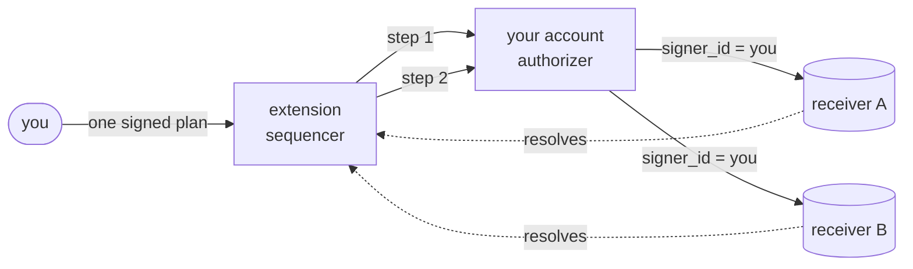

# smart-account-contract

A smart account on NEAR that makes **cross-contract composition
explicit**. Bundle function calls across any protocols into one signed
plan; gate each step with its own policy; halt cleanly on any failure.
Every arrow is a traceable receipt.

## Two things, one account

Your NEAR account becomes a **programmable identity**. A tiny
authorizer contract sits on your canonical account with an
owner-managed allowlist of *extensions*. An armed extension can
dispatch calls through your account — `signer_id` stays yours at
every downstream receiver, so account-keyed balances (e.g.
`intents.near`) still land on you. Scoped session keys extend this to
ephemeral delegates with `{expires, fire_cap, trigger allowlist,
label}`. Disarming an extension is one owner-signed tx; re-arming,
the same.

An armed extension is a **sequencer**. It registers each step of a
plan as a yielded NEP-519 receipt, then releases them in order. Step
N+1 fires only after step N's resolution surface settles and its
policy passes. Six orthogonal primitives compose per-step — execution
trust (`Direct` / `Adapter` / `Asserted`), pre-dispatch gating
(`PreGate`), value threading (`save_result` + `args_template`), and
delegation (session keys).



Every arrow is an on-chain receipt. The extension advances to step
N+1 only after step N's receipt resolves; a failed policy halts the
plan cleanly with a distinct `error_kind`. Disarm the extension at
your account and every outbound arrow refuses at the authorizer —
surgical, no redeploy.

## The six primitives

Each answers one question about a cross-contract call. Per-step,
legal in any combination:

| Question | Primitive | Mechanism |
|---|---|---|
| Can I trust this step's receipt? | `Direct` (default) | top-level resolution surface |
| Can an adapter collapse messy async? | `Adapter { adapter_id, adapter_method }` | one-hop flatten |
| Need a post-resolve byte-equality check? | `Asserted { assertion_id, assertion_method, expected_return, … }` | view-call postcheck |
| Should this step fire given live view state? | `PreGate { gate_id, gate_method, min_bytes, max_bytes, comparison }` | pre-dispatch view gate |
| Does step N+1's input come from step N's output? | `save_result` + `args_template` | substitution engine |
| Who can sign this delegated call? | Session keys | annotated FCAK + grant metadata |

One step can carry `PreGate` + `Asserted` + `args_template` +
session-key auth simultaneously. Each covers a different branch of
the cascade; each emits its own NEP-297 event.

## What you can't do with vanilla NEAR

Native batched `Actions` bundle multiple `FunctionCall`s in one tx,
but all Actions must target one `receiver_id`. Cross-contract
workflows default to fire-and-forget async. This sequencer: **one signed
plan → N steps across N contracts → halt cleanly on any policy
failure.**

Verified live:
[`7btFS8LzGQUpHari3EnzCEvyr3dU3r4egKCsnPVZMgmJ`](https://www.nearblocks.io/txns/7btFS8LzGQUpHari3EnzCEvyr3dU3r4egKCsnPVZMgmJ)
is a three-step round-trip on `intents.near` in one user tx with two
`Asserted` postchecks. **Skeptic?** Four curls in 60 seconds at
[`QUICK-VERIFY.md`](./QUICK-VERIFY.md) or run
[`./scripts/verify-mainnet-claims.sh`](./scripts/verify-mainnet-claims.sh) —
exits 0 iff the committed reference artifact still matches public
archival RPC.

## Quickstart — onboard NEAR into your `intents.near` trading balance

Assumes a deployed smart account and a signer whose key is registered
on `intents.near` (see [gotcha below](#intentsnear-gotcha-first-time-signers)).

```bash
./examples/sequential-intents.mjs \
  --signer <owner-account> \
  --smart-account <your-smart-account> \
  --amount-near 0.01
```

One tx: smart account mints 0.01 wNEAR → deposits to `intents.near`
crediting the signer → pulls it back via a NEP-413-signed
`ft_withdraw`. Each hop `Asserted` against a view on the target. Exit
code 0 iff all balances match exactly.

**Need a smart account?** [`DEPLOY-MIKE-NEAR.md`](./DEPLOY-MIKE-NEAR.md)
is the current v4 (single-contract) recipe.
[`ARCHITECTURE-V5-SPLIT.md`](./ARCHITECTURE-V5-SPLIT.md) describes the
two-contract programmable-identity split; mainnet migration plan at
[`MIGRATION-MIKE-NEAR-V5.md`](./MIGRATION-MIKE-NEAR-V5.md).

## Flagship gallery

One script per primitive (or combination). Each drops a JSON reference
artifact to `collab/artifacts/`.

- **[`sequential-intents.mjs`](./examples/sequential-intents.mjs)** —
  three-step `intents.near` round-trip with two `Asserted` postchecks.
- **[`wrap-and-deposit.mjs`](./examples/wrap-and-deposit.mjs)** —
  `Asserted` across protocols (wrap NEAR, deposit to Ref Finance).
- **[`dca.mjs`](./examples/dca.mjs)** — template + balance trigger;
  each tick runs a sequence.
- **[`limit-order.mjs`](./examples/limit-order.mjs)** — `PreGate`:
  fires only if a live view sits inside `[min, max]`.
- **[`ladder-swap.mjs`](./examples/ladder-swap.mjs)** — value
  threading: step N+1's args derived from step N's output at dispatch
  time.
- **[`session-dapp.mjs`](./examples/session-dapp.mjs)** — session
  keys: owner enrolls a scoped ephemeral key, delegate fires N times,
  owner revokes atomically.
- **[`proxy-dapp.mjs`](./examples/proxy-dapp.mjs)** — proxy keys: FCAK
  targets the smart account, not the dApp. Default run proves the
  headline mechanic — state-controlled `attach_yocto` pays a 1-yN toll
  (`require_one_yocto` probe) that the FCAK structurally cannot attach.
- **[`intents-deposit-limit.mjs`](./examples/intents-deposit-limit.mjs)** —
  four-primitive composition (`PreGate × 2` + threading + session
  keys) against mainnet `intents.near`. Pass and halt fires both
  proven live; see [`MAINNET-PROOF.md`](./MAINNET-PROOF.md).

## How the sequencer works — one paragraph

`execute_steps(steps)` registers each step as a yielded receipt
(`env::promise_yield_create`) under the caller's namespace, then
triggers ordered release. Each step waits in yielded state until the
sequencer resumes it. On resume, any `PreGate` fires first; if it
passes, args are materialized from the sequence context (if
`args_template` is set) and dispatched cross-contract. When the
downstream call settles, `on_step_resolved` inspects the resolution
surface (plus any `Asserted` postcheck), saves the return bytes if
`save_result` is set, and either advances or halts with a distinct
`error_kind` tag. That's the whole mechanism.
[Chapter 18](./md-CLAUDE-chapters/18-keep-yield-canonical.md) is the
canonical NEP-519 lifecycle walkthrough.

## The programmable-identity split

The sequencer splits across two contracts:

- **Authorizer** at your canonical account (e.g. `mike.near`). Tiny:
  `owner_id` + `extensions: IterableSet<AccountId>`. Exposes
  `dispatch(target, method, args, gas_tgas)` gated by `signer_id ==
  current_account_id()` **AND** `predecessor ∈ extensions` — two-factor
  auth, no new primitives. Also mints / revokes session keys scoped to
  the extension's `execute_trigger`.
- **Extension** at a subaccount (e.g.
  `sequential-intents.x.mike.near`). Runs the full sequencer:
  `execute_steps`, `register_step`, per-step policies, saved results,
  session grants. When a step needs `signer_id = you` at the target,
  it calls back through the authorizer.

Your identity stays thin (~280 lines of contract), the sequencer
lives elsewhere and can be disarmed surgically, and downstream receivers
still see you as the signer. Multiple extensions (trading bot, DAO
proxy, experimental sequencer) arm independently of one another.
[`ARCHITECTURE-V5-SPLIT.md`](./ARCHITECTURE-V5-SPLIT.md) has the live
testnet recipe and the design constraint the first deploy surfaced.

## Validated on mainnet

**`mike.near` runs the v4 sequencer as of 2026-04-19** (standalone
mode, `v4.0.2-ops`; the v5 split awaits its migration tranche). Every
primitive has a live reference run with block-hash anchors anyone can
verify on an archival NEAR RPC. Four reference artifacts in
[`MAINNET-PROOF.md`](./MAINNET-PROOF.md) (PreGate, value threading,
session keys, the four-primitive real-dapp `intents-deposit-limit`
against `intents.near`) plus copy-paste `curl` recipes that return
the expected events. Full tx log in
[`MAINNET-MIKE-NEAR-JOURNAL.md`](./MAINNET-MIKE-NEAR-JOURNAL.md);
deploy recipe in [`DEPLOY-MIKE-NEAR.md`](./DEPLOY-MIKE-NEAR.md).

`sequential-intents.mike.near` (v3) — deployed 2026-04-18, owner
`mike.near`. Eight battletests covered the sequencer's halt,
idempotency, and automation edges. Every tx in
[`MAINNET-V3-JOURNAL.md`](./MAINNET-V3-JOURNAL.md); design findings
in [`SEQUENTIAL-INTENTS-DESIGN.md` §10](./SEQUENTIAL-INTENTS-DESIGN.md).

## `intents.near` gotcha — first-time signers

`intents.near` maintains **its own per-account public-key registry**
independent of on-chain access keys. A signer's first
`execute_intents` call panics with `public key '<pk>' doesn't exist
for account '<signer>'` unless they first register:

```bash
near call intents.near add_public_key \
  '{"public_key":"ed25519:<your-pk>"}' \
  --accountId <your-account> --depositYocto 1 --gas 30000000000000
```

View `intents.near.public_keys_of({account_id})` to inspect. See
[§10.8 of the design note](./SEQUENTIAL-INTENTS-DESIGN.md#108--critical-finding--intentsnear-per-account-public-key-registry).

## Delegation — execution, not signing

The owner can grant another account execution rights (`run_sequence`,
`execute_trigger`) without granting any signing rights. The
`authorized_executor` is an execution delegate only; session keys
extend this to any ephemeral ed25519 keypair with a `SessionGrant`
annotation.

## Layout

| Path | What lives here |
|---|---|
| `contracts/smart-account/` | The sequencer. All six primitives; `execute_steps` facade, manual `register_step` / `run_sequence`, balance-trigger automation, session-key auth hub. `authorizer_id: Option<AccountId>` toggles standalone vs extension mode. |
| `contracts/authorizer/` | The programmable-identity half: `owner_id` + `extensions` allowlist + `dispatch` / `add_session_key` / `delete_session_key`. Deploys at the user's canonical account. |
| `contracts/compat-adapter/` | Real external-protocol adapter surface (`Adapter` primitive); currently wrap-specific. |
| `contracts/demo-adapter/` | Demo-only adapter for `wild-router`. |
| `contracts/echo/`, `contracts/router/` | Downstream leaves for trace demos. |
| `contracts/wild-router/`, `contracts/pathological-router/` | Dishonest-async + pathology probes. |
| `types/` | `smart-account-types` — shared shapes (`StepPolicy`, `PreGate`, `SaveResult`, `ArgsTemplate`, `Substitution`, `SubstitutionOp`, `MaterializeError`) and pure helpers (`evaluate_pre_gate`, `materialize_args`). |
| `examples/` | Runnable flagships; one per primitive or combination. [README](./examples/README.md). |
| `scripts/` | Build/deploy + FastNEAR observability toolkit. [README](./scripts/README.md). |
| `web/` | Static-HTML receipt-DAG viewer (no bundler). |
| `simple-example/` | Nested mini-workspace — the bare yield/resume loop, no facade. |
| `md-CLAUDE-chapters/` | Design chapters, one per primitive. |

## Commands

```bash
cp .env.example .env          # paste FASTNEAR_API_KEY; stays out of git
./scripts/check.sh            # cargo check + cargo test + node unit tests
cargo test --workspace        # all Rust tests
./scripts/build-all.sh        # release wasm → res/*_local.wasm
MASTER=x.mike.testnet ./scripts/deploy-testnet.sh   # standalone testnet rig
python3 -m http.server 8000 -d web                  # trace viewer
```

The v5 authorizer-at-root + extension-at-subaccount pair isn't deployed
by `deploy-testnet.sh` — its topology requires the authorizer on the
signer's own account. Recipe: "Testnet recipe" section of
[`ARCHITECTURE-V5-SPLIT.md`](./ARCHITECTURE-V5-SPLIT.md). Flagship
scripts auto-load `.env` and drop JSON artifacts to `collab/artifacts/`
on every live run.

## Reading paths

**In 5 minutes.** Read this README top to bottom, then skim the header
of [`examples/sequential-intents.mjs`](./examples/sequential-intents.mjs).

**In 60 seconds — verify mainnet.** Run
[`./scripts/verify-mainnet-claims.sh`](./scripts/verify-mainnet-claims.sh)
or walk [`QUICK-VERIFY.md`](./QUICK-VERIFY.md).

**In 20 minutes.**

1. This README.
2. [`ARCHITECTURE-V5-SPLIT.md`](./ARCHITECTURE-V5-SPLIT.md) — the
   programmable-identity split + live testnet recipe.
3. [`FLAGSHIP-HOWTO.md`](./FLAGSHIP-HOWTO.md) — decision table +
   common skeleton for writing your own flagship.
4. [`simple-example/README.md`](./simple-example/README.md) — the
   bare `register_step` + `run_sequence` loop, no facade.

**In 40 minutes.** One chapter per primitive (compose orthogonally):

- [Chapter 14](./md-CLAUDE-chapters/14-wild-contract-compatibility.md) — `Direct` / `Adapter`
- [Chapter 18](./md-CLAUDE-chapters/18-keep-yield-canonical.md) — NEP-519 lifecycle
- [Chapter 21](./md-CLAUDE-chapters/21-asserted-resolve-policy.md) — `Asserted`
- [Chapter 23](./md-CLAUDE-chapters/23-pre-gate-policy.md) — `PreGate`
- [Chapter 24](./md-CLAUDE-chapters/24-value-threading.md) — value threading
- [Chapter 25](./md-CLAUDE-chapters/25-session-keys.md) + [`SESSION-KEYS.md`](./SESSION-KEYS.md) — session keys

Then the code:
[`contracts/smart-account/src/lib.rs`](./contracts/smart-account/src/lib.rs)
and
[`contracts/authorizer/src/lib.rs`](./contracts/authorizer/src/lib.rs).

### Best first theorem

> An armed extension yields a downstream plan under your account's
> authority, and only creates step N+1's receipt after step N's trusted
> resolution surface resolves — at every downstream receiver, the signer
> is still you.

### Best first caution

`Direct` is about callback-visible completion, not guaranteed semantic
truth for every protocol. Empty returns are fine; hidden async that
isn't returned is the danger. That's why `Adapter` and `Asserted`
exist.

## Further reading

- [`ARCHITECTURE-V5-SPLIT.md`](./ARCHITECTURE-V5-SPLIT.md) — thin authorizer on root + sequencer extension on subaccount; testnet-validated.
- [`MIGRATION-MIKE-NEAR-V5.md`](./MIGRATION-MIKE-NEAR-V5.md) — mainnet cutover plan for `mike.near` v4 → v5.
- [`observer/`](./observer/) — Rust binary with two modes: `stream` tails `sa-automation` events live via FastNEAR neardata; `trace` fetches one tx via the TX API and renders a receipt-DAG walkthrough showing NEP-519 yield/resume hops, event emissions, and gas burn — archival-anchored and falsifiable forever.
- [`PROXY-KEYS.md`](./PROXY-KEYS.md) — dApp-login FCAKs that target the smart account, not the dApp. One atomic tx writes the grant + mints the FCAK; `proxy_call` dispatches downstream with a state-controlled 1 yN deposit the smart account pays on the user's behalf.
- [`INTENTS.md`](./INTENTS.md) — this smart account vs `intents.near`, when to use which.
- [`SESSION-KEYS.md`](./SESSION-KEYS.md) — annotated-FCAK session-key walkthrough (enroll → fire → revoke, safety model).
- [`PROTOCOL-ONBOARDING.md`](./PROTOCOL-ONBOARDING.md) — adding a new protocol as a step; primitive decision tree.
- [`FLAGSHIP-HOWTO.md`](./FLAGSHIP-HOWTO.md) — contributor guide: composing primitives into a new runnable flagship.
- [`DEPLOY-MIKE-NEAR.md`](./DEPLOY-MIKE-NEAR.md) — two-phase recipe for deploying v4 to the `mike.near` root identity account.
- [`DEPLOY-SEQUENTIAL-INTENTS.md`](./DEPLOY-SEQUENTIAL-INTENTS.md) — historical v3 deploy recipe for `sequential-intents.mike.near`.
- [`SEQUENTIAL-INTENTS-DESIGN.md`](./SEQUENTIAL-INTENTS-DESIGN.md) — flagship design: `intents.near` surface map, battletest findings, §10 critical discoveries.
- [`MAINNET-MIKE-NEAR-JOURNAL.md`](./MAINNET-MIKE-NEAR-JOURNAL.md) — tx log for v4 on `mike.near`.
- [`MAINNET-V3-JOURNAL.md`](./MAINNET-V3-JOURNAL.md) — historical v3 tx log on `sequential-intents.mike.near`.
- [`MAINNET-PROOF.md`](./MAINNET-PROOF.md) — four curated reference artifacts + copy-paste `curl` recipes on public archival RPC.
- [`QUICK-VERIFY.md`](./QUICK-VERIFY.md) — 60-second falsifiability path.
- [`REPRODUCIBLE-BUILD.md`](./REPRODUCIBLE-BUILD.md) — source-to-deployed-binary hash recipe under the pinned toolchain.
- [`HARDENING-REVIEW.md`](./HARDENING-REVIEW.md) — candid repo-shape critique.
- [`SISTER-REPOS.md`](./SISTER-REPOS.md) — three-repo positioning: this repo, [`near-sequencer-demo`](../near-sequencer-demo/), [`manim-visualizations`](../manim-visualizations/).
- [`md-CLAUDE-chapters/README.md`](./md-CLAUDE-chapters/README.md) — chapter map: one chapter per primitive.
- [`simple-example/README.md`](./simple-example/README.md) — the bare `register_step` / `run_sequence` loop.

This is an exploratory lab — probing the solution space for signal,
not shipping yet. `mike.near`'s v4 deploy is a live reference, not a
vault; nothing here is load-bearing production infrastructure.
