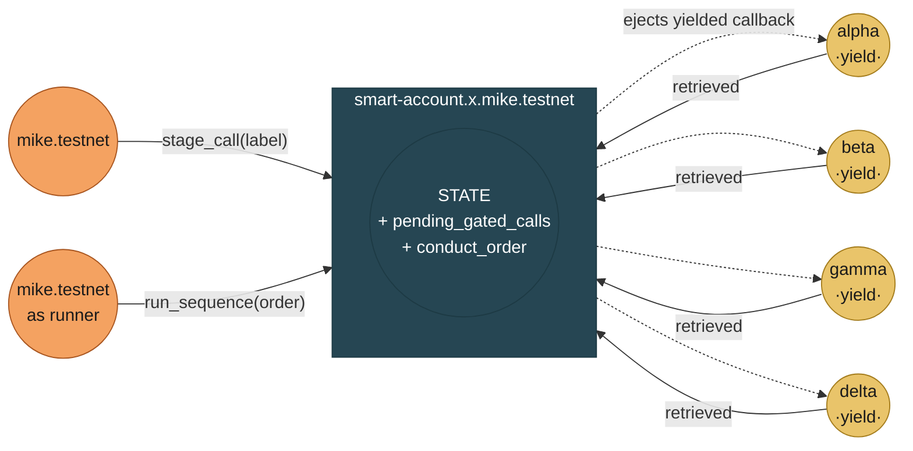
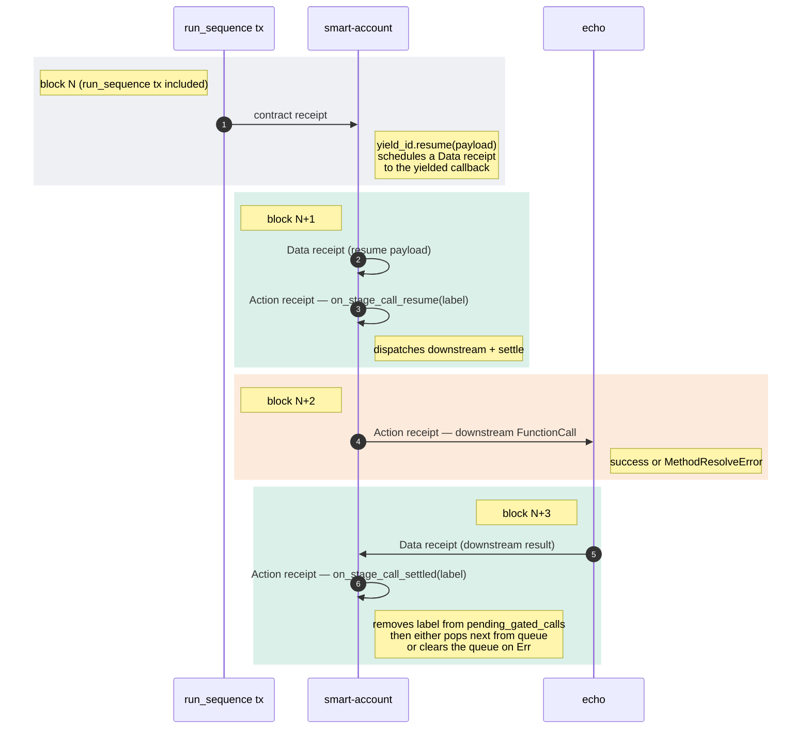
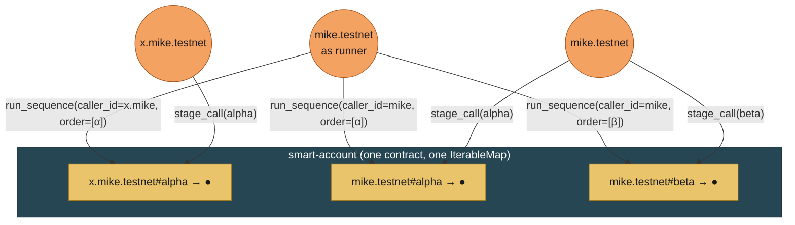
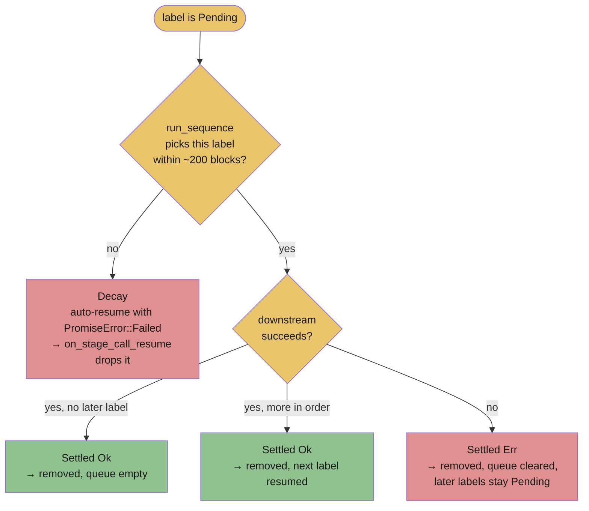

# 11 · The orbital model — diagrams

**BLUF.** The sequencing pattern this repo has been validating is easier
to think about as **orbital mechanics** than as a callback graph: the
contract is a central sphere, each `stage_call` ejects a yielded callback
into orbit, `run_sequence` is a ground-station pass that retrieves
satellites, and unrecovered orbits decay after ~200 blocks. This chapter
draws the picture six ways: a hub-and-spoke headline diagram, the
lifecycle state machine of one label, one cascade step in
sequence-diagram form, the full halt-then-retry saga, the two-orbits
cross-caller view, and the four-fates flowchart. A glossary at the end
maps the orbital words back to the contract code.

---

## 1. Headline — the sphere with satellites



Caller pushes labels onto orbit through `stage_call`; the runner
retrieves them through `run_sequence`. The contract holds the orbital
records (`pending_gated_calls`) so a satellite remembers it exists even
after the calling tx finalizes.

## 2. One label's lifecycle

```mermaid
stateDiagram-v2
    [*] --> Pending : stage_call
    Pending --> Resuming : run_sequence picks this label
    Resuming --> Downstreaming : on_stage_call_resume<br/>dispatches the real call
    Downstreaming --> Settling : downstream completes (ok or fail)
    Settling --> Drained_Ok : on_stage_call_settled<br/>(Ok branch)<br/>advances queue to next label
    Settling --> Drained_Halt : on_stage_call_settled<br/>(Err branch)<br/>clears active sequence
    Pending --> Decaying : ~200 blocks elapse<br/>without a run_sequence
    Decaying --> Drained_TO : on_stage_call_resume<br/>sees PromiseError::Failed<br/>and drops the entry
    Drained_Ok --> [*]
    Drained_Halt --> [*]
    Drained_TO --> [*]
```

Three exits for any label: **Drained_Ok** (the desired path),
**Drained_Halt** (downstream failed), **Drained_TO** (orbit decayed
before retrieval). The contract has no fourth state — every label
eventually leaves the map.

## 3. One cascade step, block by block

This is the protocol-level shape of a single retrieval cycle. Three
blocks of receipt traffic per label.



**Total: 4 blocks** end-to-end (run_sequence tx through settle), of
which 3 (N+1 through N+3) are the cascade itself. Each subsequent label
adds 3 more blocks to the cascade chain.

## 4. The full halt-then-retry saga (chapters 06–08)

```mermaid
sequenceDiagram
    autonumber
    actor User as mike.testnet
    participant SA as smart-account
    participant Echo as echo

    Note over User,Echo: Phase 1 — batch
    User->>SA: stage_call(alpha)
    User->>SA: stage_call(beta)<br/>[planned failure]
    User->>SA: stage_call(gamma)
    User->>SA: stage_call(delta)
    Note right of SA: pending = [α, β, γ, δ]

    Note over User,Echo: Phase 2 — first run_sequence (mixed order)
    User->>SA: run_sequence(order=[α, β, γ, δ])
    SA-->>SA: cascade α
    SA->>Echo: echo_log(α) — ok
    Echo-->>SA: ok
    Note right of SA: settled Ok → pops β
    SA-->>SA: cascade β
    SA->>Echo: not_a_method(β) — fail
    Echo-->>SA: MethodNotFound
    Note right of SA: settled Err → halts;<br/>pending = [γ, δ]

    Note over User,Echo: Phase 3 — retry on remaining set
    User->>SA: run_sequence(order=[γ, δ])
    SA-->>SA: cascade γ
    SA->>Echo: echo_log(γ) — ok
    SA-->>SA: cascade δ
    SA->>Echo: echo_log(δ) — ok
    Note right of SA: pending = [ ]
```

Three phases, two `run_sequence` calls, one halt, three labels drained
via Ok and one via Halt. This is the pattern captured live in
[`archive-staged-call-lineage.md`](./archive-staged-call-lineage.md) §2
under the mixed-outcome run.

## 5. Cross-caller isolation



Two satellites named *alpha* coexist around the same sphere because the
storage key is `caller_id#label`, not just `label`. The runner role
decides which caller's set to retrieve from.

## 6. Four fates of a label

Where a label ultimately exits the pending map. Reading top-to-bottom
gives you the decision the contract makes for any pending entry.



Two of the four exits are intentional success paths
(`OkDone` / `OkAdvance`); the other two (`Halt` / `Decay`) are the
failure paths validated in the dual-failure run of
[`archive-staged-call-lineage.md`](./archive-staged-call-lineage.md) §2.
The diagram above is what makes "the saga semantic is closed" concrete:
every fate is observable and handled.

## 7. Glossary — orbital ↔ code

| Orbital word | Contract code | Where it shows up live |
|---|---|---|
| sphere | `smart-account.x.mike.testnet` (one contract) | the receiver of every `stage_call` and `run_sequence` |
| satellite | one yielded callback receipt | each `[yield]`-marked receipt in `trace-tx.mjs` output |
| orbital record | one `(caller_id#label) → PendingGatedCall` entry | each row of `staged_calls_for(caller_id)` |
| orbit | NEP-519 yield (lives ~200 blocks) | the gap between batch receipt block and forced timeout |
| eject (push to orbit) | `stage_call(...)` action | the FunctionCall actions inside any batch tx |
| ground station | the `run_sequence`-callable role (owner or authorized_runner) | mike.testnet in our deployed rig |
| ground-station pass | one `run_sequence` tx | each "run_sequence #N" tx hash in our chapters |
| retrieval payload | `yield_id.resume(payload)` data receipt | the Data receipt at block N+1 of a cascade step |
| retrieval cycle | resume → downstream → settle (3 blocks) | the 3-block cascade chunk per label |
| decay | NEP-519 200-block expiry → `PromiseError::Failed` | block 246227624 in the dual-failure run of `archive-staged-call-lineage.md` |
| disintegration on retrieval | downstream `Failure` → `Err` branch in settle | beta in dual-failure run; alpha/beta/gamma in retry run (same archive) |
| caller's flight | one caller's set of orbital records | each row group in the cross-caller side-by-side state table in `archive-automation-lineage.md` §4.2 |

## 8. Why the orbital frame is generative

The picture above is not just decoration — it suggests new experiments
by analogy:

- **Constellation rendezvous**: can multiple labels' downstreams be
  *simultaneous* (a real `promise_and` inside a `stage_call`'s
  downstream)? Today each cascade step is strictly sequential.
- **Higher orbits**: can a `stage_call`'s downstream itself be a
  `stage_call` on a different contract? Nested orbits — the recursion
  case discussed under the staged-call lineage archive's semantics
  section.
- **Orbit-to-orbit transfer**: can a satellite be re-staged onto a
  different label without round-tripping through `Drained_Ok`? Today
  the only re-entry is via a fresh `stage_call`.
- **De-orbit burn**: a *compensation* path — `on_stage_call_compensate`
  that runs on Halt to undo previous Ok cascades. The classical-saga
  missing piece.
- **Multiple ground stations**: separate `authorized_runner` accounts,
  potentially with role-restricted retrieval rights (e.g., a runner
  permitted only for specific callers or labels).

Each of these is a future chapter the model already gestures at.
That's the test of a good metaphor — it doesn't just describe what is,
it predicts what could be next.

---

*Diagrams render inline in GitHub, VS Code, and most markdown
previewers. The Mermaid source is intentionally kept as text so this
chapter remains diffable, searchable, and editable from the same tools
as every other chapter.*
